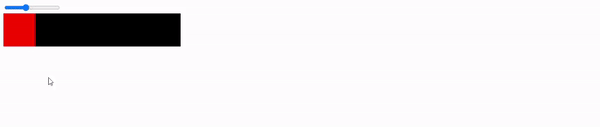
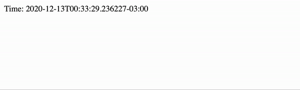
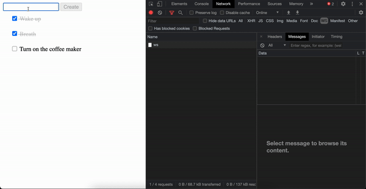
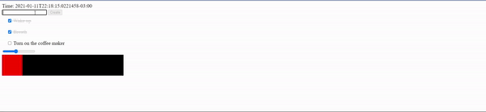
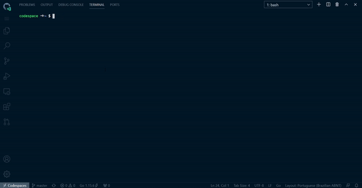

# GoLive 
## 💻 Reactive HTML Server Side Rendered by GoLang over WebSockets 🚀
Use Go and ***Zero JavaScript*** to program reactive front-ends!



## How?
1. Render Server Side HTML 
2. Connect to same server using Websocket 
3. Send user events
4. Change state of component in server
5. Render Component and get the Diff
6. The update instructions is sended to browser

## Getting Started
- [Bumped Todo Example](https://github.com/SamHennessy/golive-example)
- [Project Examples](https://github.com/brendonferreira/golive/tree/master/examples)
- [GoBook - Interactive Go REPL in browser](https://github.com/brendonferreira/gobook)

**Any suggestions are absolutely welcome**

This project it's strongly inspired by Elixir Phoenix LiveView.

## Component Example
```go
package components 

import (
	"github.com/brendonferreira/golive"
	"time"
)

type Clock struct {
	golive.LiveComponentWrapper
	ActualTime string
}

func NewClock() *golive.LiveComponent {
	return golive.NewLiveComponent("Clock", &Clock{})
}

func (t *Clock) Mounted(_ *golive.LiveComponent) {
	go func() {
		for {
			t.ActualTime = time.Now().Format(time.RFC3339Nano)
			time.Sleep((time.Second * 1) / 60)
			t.Commit()
		}
	}()
}

func (t *Clock) TemplateHandler(_ *golive.LiveComponent) string {
	return `
		<div>
			<span>Time: {{ .ActualTime }}</span>
		</div>
	`
}
```

### Server Example
```go
  
package main

import (
	"github.com/brendonferreira/golive"
	"github.com/brendonferreira/golive/examples/components"
	"github.com/gofiber/fiber/v2"
	"github.com/gofiber/websocket/v2"
)

func main() {
	app := fiber.New()
	liveServer := golive.NewServer()

	app.Get("/", liveServer.CreateHTMLHandler(components.NewClock, golive.PageContent{
		Lang:  "us",
		Title: "Hello world",
	}))

	app.Get("/ws", websocket.New(liveServer.HandleWSRequest))

	_ = app.Listen(":3000")
}
```

### That's it!


## More Examples

### Slider


### Simple todo


### All at once using components!


### GoBook

[Go to repo](https://github.com/brendonferreira/gobook)

## TODO
 - [ ] Establish version
 - [ ] Configure CI stuff
    - [x] Auto Tests
    - [ ] Coverage
 - [ ] Document
    - [ ] Component Lifetime
    - [ ] "turn off" components
    - [ ] Recommended project structure
 - [x] Components
    - [x] Subcomponents
    - [x] "turn off" unneeded components
 - [x] Decide what LiveWire will connect. It will continue to be the page, or the scope makes more sense?
 - [ ] Throttling events in & out 
 - [ ] Optimize
    - [ ] Benchmark
    - [ ] Merge component changes
    - [ ] Minify comm. payload

