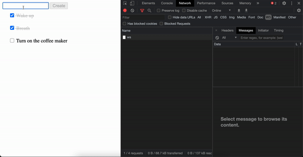

# GoLive



**Any suggestions are absolutely welcome**

This project it's strongly inspired by Elixir Phoenix LiveView.

## Getting Started
`WIP`

## Component Example
```go
package components 

import (
	"github.com/brendonferreira/golive"
	"time"
)
type Clock struct {
	golive.LiveComponentWrapper
	ActualTime string
}

func NewClock() *golive.LiveComponent {
	return golive.NewLiveComponent("Clock", &Clock{
		ActualTime: "91230192301390193",
	})
}

func (t *Clock) Mounted(_ *golive.LiveComponent) {
	go func() {
		for {
			t.ActualTime = time.Now().Format(time.RFC3339Nano)
			time.Sleep((time.Second * 1) / 60)
			t.Commit()
		}
	}()
}

func (t *Clock) TemplateHandler(_ *golive.LiveComponent) string {
	return `
		<div>
			<span>Time: {{ .ActualTime }}</span>
		</div>
	`
}
```

### Server Example
```go
  
package main

import (
	"github.com/brendonferreira/golive"
	"github.com/brendonferreira/golive/examples/components"
	"github.com/gofiber/fiber/v2"
	"github.com/gofiber/websocket/v2"
)

func main() {
	app := fiber.New()
	liveServer := golive.NewServer()

	app.Get("/", liveServer.CreateHTMLHandler(components.NewClock, golive.PageContent{
		Lang:  "us",
		Title: "Hello world",
	}))

	app.Get("/ws", websocket.New(liveServer.HandleWSRequest))

	_ = app.Listen(":3000")
}
```

## That's it!


## TODO
 - [ ] Establish version
 - [ ] Configure CI stuff
    - [x] Auto Tests
    - [ ] Coverage
 - [ ] Document
    - [ ] Component Lifetime
    - [ ] "turn off" components
    - [ ] Recommended project structure
 - [x] Components
    - [x] Subcomponents
    - [x] "turn off" unneeded components
 - [x] Decide what LiveWire will connect. It will continue to be the page, or the scope makes more sense?
 - [ ] Throttling events in & out 
 - [ ] Optimize
    - [ ] Benchmark
    - [ ] Merge component changes
    - [ ] Minify comm. payload

